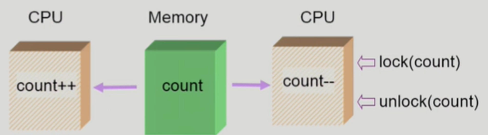
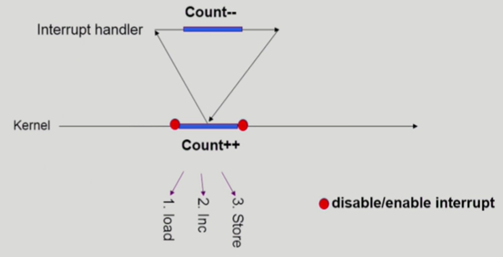

# CS 스터디 _ 반효경 _ 운영체제

 목차
- 운영체제란?
- 컴퓨터시스템의 구조
- 프로세스 관리
- **CPU 스케쥴링**
- **병행 제어**
- 데드락
- 메모리 관리
- 가상 메모리
- 파일 시스템
- 입출력 시스템
- 디스크 관리

---

# CPU 스케줄링 2

**멀티 레벨 피드백 큐**

- 프로세스가 여러개로 분할된 레디 큐 내에서 다른 큐로 이동 가능
- 멀티 레벨 피드백 큐를 이용해 aging 기법으로 구현 가능
    - aiging 기법은 우선순위가 낮은 큐에서 오래 기다렸으면, 우선 순위가 높은 큐로 승격하는 방식
- 멀티 레벨 피드백 큐를 정의하는 요소
    - 큐의 수
    - 각 큐의 스케줄링 알고리즘
    - 프로세스를 상위/하위 큐로 승격/강등하는 기준
    - 프로세스가 도착했을 때 들어갈 큐를 결정하는 기준 (보통 처음 들어옹는 프로세스는 우선 순위가 가장 높은 큐에 CPU할당 시간을 짧게 하여 배치한다. 만약 주어진 할당 시간 안에 작업을 완료하지 못하면 CPU할당 시간을 조금 더 주되, 우선 순위가 한단계 낮은 큐로 강등한다.
        
        ⇒ 이 과정을 반복하다가 최하위 큐에 배치 된다.
        

**다중 처리기 스케줄링**

- CPU가 여러개인 시스템에서 활용하는 기법
- 프로세스를 레디큐에 한줄로 세워 각 CPU가 알아서 다음 프로세스를 꺼내어 가도록 한다.
- 일부 CPU에 작업이 편중되는 현상을 방지하기 위해 로드 밸런싱 메커니즘을 사용한다
    - 로드 밸런싱: 작업을 여러 리소스(서버, 가상머신 또는 컨테이너 등)에 균등하게 분배하여 부하를 분산시키는 방법이다.
        
        (for 시스템의 가용 리소스 최대한 활용, 응답시간 개선, 장애 대비성 향상)
        
    - 대칭형 다중 처리: 작업을 여러부분으로 분할하고 작업을 병렬로 처리하는 방법 (for 작업속도 향상)

**실시간 스케줄링**

- 정해진 시간 안에 반드시 실행되어야 하는, 데드라인이 있는 프로세스 일때 사용하는 기법
- hard real-time system
    - 정해진 시간 안에 반드시 작업이 끝나도록 스케줄링해야 함
- soft real-time system
    - 데드라인이 존재하긴 하지만 지키지 못했다고 해서 위험한 상황이 생기지는 않는다
    - 일반 프로세스에 비해 높은 우선 순위를 갖도록 구현

**스레드 스케줄링**

- 로컬 스케줄링
    - 유저 레벨 스레드의 경우 운영체제가 해당 스레드의 존재를 모름
    - OS가 아닌 사용자 프로세스가 직접 어느 스레드한테 CPU를 줄것인지 결정
- 글로벌 스케줄링
    - 커널 레벨 스레드에 경우 일반 프로세스처럼 커널의 단기 스케줄러가 어떤 스레드를 스케줄링할 지 결정

### 스케줄링 알고리즘의 평가

**큐잉 모델(주로 이론가들이 수행)**

확률 분포를 통해 프로세스들의 도착률과 CPU 처리율을 입력값으로 주면, 복잡한 수학적 계산을 통해 각종 성능 지표인 CPU의 처리량, 프로세스의 평균 대기시간 등을 구하게 된다.

**구현 및 실축 (주로 구현가들이 수행)**

운영 체제 커널의 소스 코드 중 CPU 스케줄링을 수행하는 코드를 수정해서 커널을 컴파일한 후 시스템에 설치한다. 그런 다음 동일한 프로그램을 원래 커널과 CPU 스케줄러를 수정한 커널에서 수행해 보고 실행 시간을 측정

구현은 알고리즘을 실제로 시스템에 적용하고 실행하는 것으로, 알고리즘의 성능과 효과를 직접 확인할 수 있다. 구현을 통해 알고리즘의 실제 동작과 성능을 평가하고, 시스템의 실제 데이터와 상호작용하는 등 더 많은 정보를 얻을 수 있다.

**시뮬레이션**

가상으로 CPU 스케줄링 프로그램을 작성한 후 프로그램의 CPU 요청을 입력값으로 넣어 어떠한 결과가 나오는지 확인한다.

시뮬레이션은 구현하기 전에 알고리즘의 개념적인 동작과 성능을 평가하는 데 도움이 된다. 시뮬레이션을 사용하면 다양한 시나리오에서 알고리즘을 테스트하고 비교할 수 있다. 또한, 시뮬레이션은 알고리즘을 구현하는데 필요한 비용과 시간을 절약할 수 있는 장점이 있다.

# Process Synchronization 1

### 데이터 접근

컴퓨터 시스템에서 데이터 연산은 저장 공간과 실행 공간이 아래와 같은 흐름으로 동작하면서 이루어 진다.

1. 저장 공간에 데이터가 있다.
2. 연산할 데이터를 실행 공간으로 가져온다.
3. 실행 공간에서 연산한다.
4. 연산 결과를 저장 공간에 반영한다.

저장 공간은 메모리나 해당 프로세스의 주소 공간, 디스크 등이 있고, 실행 공간은 CPU나 프로세스, 컴퓨터 내부 등이 있다.

프로세스와 스레드가 동작하면서 공유메모리/자원을 사용하게 될 땐 동기화 문제를 짚고가야 한다.

공유 자원에 여러 프로세스/스레드가 동시에 접근할 경우 race condition 문제가 발생한다.

### **Race Condition**

레이스 컨디션 (Race Condition)은 동시에 여러 프로세스 또는 스레드가 공유 자원에 접근하여 예기치 않은 결과를 가져오는 상황을 말한다. 이러한 상황은 공유 자원의 일관성을 해치고, 예상치 못한 동작을 야기할 수 있다.

예를 들어 메모리에 count 변수가 있고 서로 다른 CPU가 각각 증가 연산, 감소 연산을 한다고 가정해 보자.

정상적인 동작을 한다면 CPU A가 count 변수를 가져와 1 증가하여 메모리에 반영하고, CPU B가 count 변수를 가져와 1 감소하고 다시 메모리에 반영하여 count 변수 값의 변화가 없을 것이다. 하지만 CPU A에서 증가 연산을 하는 동안 CPU B가 메모리에 있는 count 변수를 가져가서 연산한다면 결과는 `(count - 1)`이 저장될 것이다.

- 운영 체제에서 race condition이 발생하는 상황
    - 커널 수행 중 인터럽트 발생 시
    - 프로세스가 시스템 콜을 호출하여 커널 모드로 수행 중인 가운데 context switch가 일어나는 경우
    - 멀티 프로세서에서 공유 메모리 내의 커널 데이터

### 운영체제에서의 race condition 1. 인터럽트 핸들러 vs 커널

커널 모드가 수행 중인 상태에서 인터럽트가 발생하여 인터럽트 처리 루틴이 실행되는 상황이다. 인터럽트 핸들러에서 공유 자원에 대한 잠금을 얻지 않고 접근하면 race condition이 발생할 수 있다

중요한 변수의 값을 건드리는 동안에는 인터럽트가 발생해도 연산이 끝나고 수행될 수 있게끔 disable 처리를 해 준다.

### 운영체제에서의 race condition 2. 커널 내에서 실행중인 프로세스를 선점하는 경우

프로세스가 커널 모드에서 실행되는 동안 다른 프로세스로의 전환(context switch)이 발생할 수 있다. 이 때 공유 자원에 대한 동기화 메커니즘이 제대로 구현되지 않으면, 여러 프로세스가 동시에 접근하여 race condition이 발생할 수 있다.

### 운영체제에서의 race condition 3. **멀티 프로세서**

멀티 프로세서는 CPU가 메모리에서 데이터를 가져 오기 전에 lock을 걸어 다른 CPU가 같은 데이터에 접근하는 것을 막아 준다. 연산이 끝난 후 데이터를 다시 메모리에 저장할 때 lock을 풀어 줌으로써 다른 CPU가 접근할 수 있게 해 준다.

이때 멀티 프로세서 시스템에서 여러 프로세서가 공유 메모리에 접근하는 경우, 공유되는 커널 데이터에 대한 접근에 대한 동기화가 필요하다. 이 때 동기화 메커니즘이 제대로 구현되지 않으면, 여러 프로세서가 동시에 데이터를 수정하거나 읽어오면서 race condition이 발생할 수 있다. 

### *****Race Condition 프로그램적 해결의 충족 조건*****

가정

모든 프로세스의 수행 속도는 0보다 크다.

프로세스들 간의 상대적인 수행 속도는 가정하지 않는다.

1. 상호 배제 : 배타적으로 접근
    
    프로세스가 임계영역 부분을 수행중이면 다른 모든 프로세스들은 그들의 임계영역에 들어가면 안 된다
    
2. Progress : 비어있을 때는 사용하게 해줘야 한다.
    
    아무도 임계영역에 있지 않은 상태에서 임계영역에 들어가고자 하는 프로세스가 있으면 임게영역에 들어가게 해주어야한다.
    
3. Bounded Waiting : 기다리는 시간이 유한해야 한다.
    
    프로세스가 임계영역에 들어가려고 요청한 후부터 그 요청이 허용될 때까지 다른 프로세스들이 임계영역에 들어가는 횟수에 한계가 있어야한다.
    

⇒ 즉 하나의 데이터에 대한 여러 연산 요청이 있을 땐 이를 조절해줘야 하고, 이를 조절하는 특별한 규칙이 바로바로  

### ***프로세스/스레드 동기화이다!***
